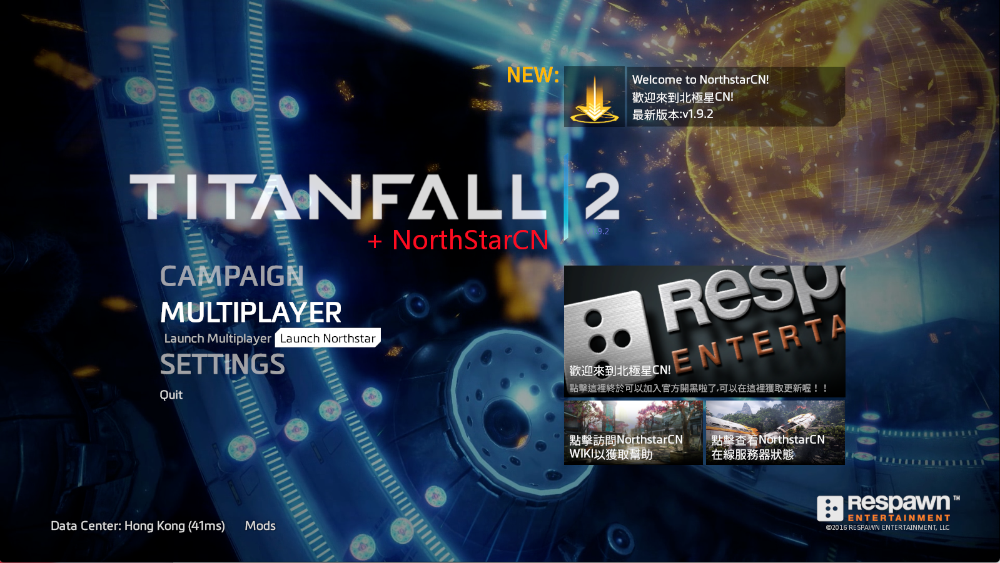
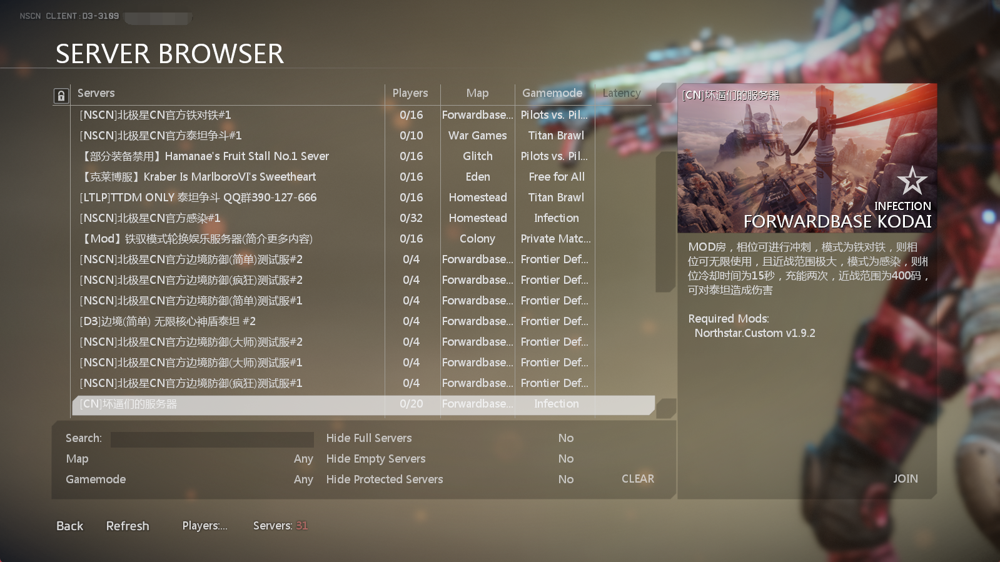

# 安装&启动&更新

## 安装&启动NorthStarCN

请记住， NorthStarCN 仅在 PC 端可用 **并且需要您拥有并安装了TTF2游戏，游戏文件路径中 `不能` 有中文字符**.

1. 点击[下载](https://gitee.com/R2NorthstarCN/R2NorthstarCN_Launcher/releases/download/v1.9.4/%E5%8C%97%E6%9E%81%E6%98%9FCN%E4%B8%80%E9%94%AE%E5%90%AF%E5%8A%A8%E5%99%A8.exe) `北极星CN一键启动器.exe`，并将其放置在合适位置

2. 双击 `北极星CN一键启动器.exe` 程序将会自动定位您的游戏安装位置，并自动下载安装NorthStarCN资源，随后为您启动游戏
   * 第一次启动时，启动器会自动定位您的游戏安装位置，自动下载安装NorthStarCN资源，游戏退出后会在桌面上生成一个缓存文档，请您不要删除它，否则下一次启动游戏时需要再生成一次

3. 在第一次启动NorthStarCN时，我们将会询问您是否同意与我们的主服务器进行验证. 如果您希望在NorthStarCN上游玩，请单击 _Yes_ ，若您需要更改选项，也可以稍后在界面左下角的 Mod 菜单中进行更改
     

4. 点击 _启动 NorthStarCN_ 
   

5. 在服务器列表中，您可以自由选择加入由社区或玩家架设的服务器进行游戏.
   

如果您在游玩过程中遇到报错 , 请先查看 [故障排除](../installing-northstar/troubleshooting.md)

建议您加入我们的[KOOK服务器](https://kook.top/qetaS2)或[QQ吹水群](https://jq.qq.com/?_wv=1027&k=Dk5g9Okj)

## 更新 NorthStarCN

您并不需要手动更新NorthStarCN，启动器会为您检查最新版本并自动下载安装，您的配置文件在更新安装前将会被自动备份

若您因其他情况导致不能使用`北极星CN一键启动器.exe`的，可以到我们的官网下载最新版本的启动器压缩包文件，之后将压缩包内所有文件解压覆盖至您的TitanFall 2游戏根目录下即可，请注意备份好您的`ns_startup_args.txt`或`ns_startup_args_dedi.txt`中启动项的设置，若有特殊情况，请查看我们的[KOOK服务器](https://kook.top/qetaS2)或[QQ吹水群](https://jq.qq.com/?_wv=1027&k=Dk5g9Okj)

## 游戏启动项

尽管在运行游戏时您需要将`Origin`保持在后台运行，但是启动器默认并不能读取`Origin`中您设置的附加启动项，您可以将所需要的启动项添加至 `ns_startup_args.txt`, 该文件位于TTF2游戏的根目录中

例如:
```
-multiple -novid -high
```