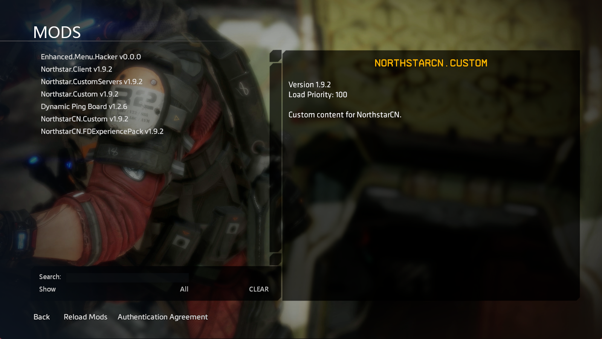

# 游戏MOD模组

## 预置MOD

NorthStarCN运行所必须的模块以MOD为单位预置在了`Titanfall2\R2Northstar\mods` 文件夹中，以下所有MOD是NorthStarCN运行所必要的模块

- **Northstar.Client**
- **Northstar.Custom**
- **Northstar.CustomServers**
- **NorthstarCN.Custom**
- **NorthstarCN.FDExperiencePack**

## 社区MOD

你可以在[Northstar.ThunderStore](https://northstar.thunderstore.io/)下载MOD

您也可以查看KOOK服务器`MOD转载发布`频道来下载一些汉化或原创MOD