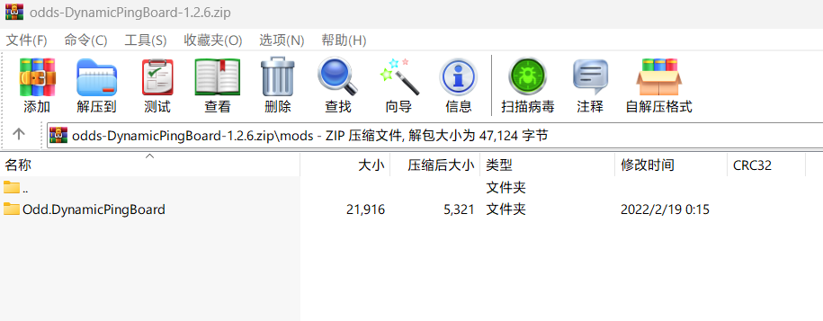
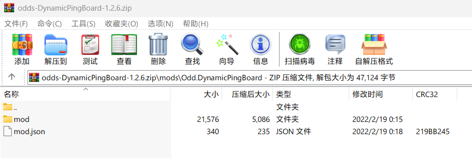
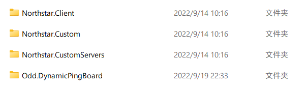

# 游戏MOD模组

## 预置核心MOD

NorthStarCN运行所必须的模块以MOD为单位预置在了`Titanfall2\R2Northstar\mods` 文件夹中，以下所有MOD是NorthStarCN运行所必要的模块

- **Northstar.Client**
- **Northstar.Custom**
- **Northstar.CustomServers**

## 社区MOD

你可以在[Northstar.ThunderStore](https://northstar.thunderstore.io/)下载MOD

您也可以查看KOOK服务器`MOD转载发布`频道来下载一些汉化或原创MOD

## 如何安装MOD？

MOD文件通常以压缩文件的格式进行分发，完成您所需的MOD的下载后，您应该将MOD文件解压至Titanfall 2游戏根目录下的`\R2Northstar\mods`中

此处我们将使用`DynamicPingBoard-1.2.6`举例

打开压缩包，找到子目录中包含了MOD文件的文件夹

若您不清楚该文件夹的子目录中是否包含了MOD文件，则可点击文件夹查看其子目录

若该文件夹中包含了一个名为`mod`的文件夹和一个`mod.json`的json文件，则这个文件夹中包含了您所需要的MOD文件，返回到上一目录，将该文件夹解压到`\R2Northstar\mods`中即可

